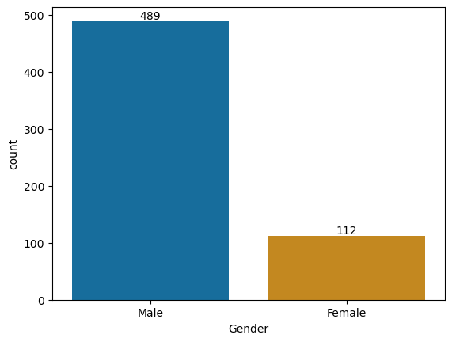
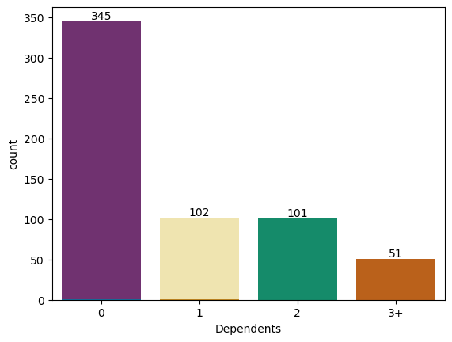
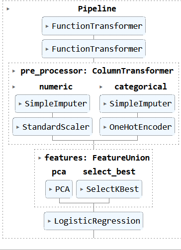
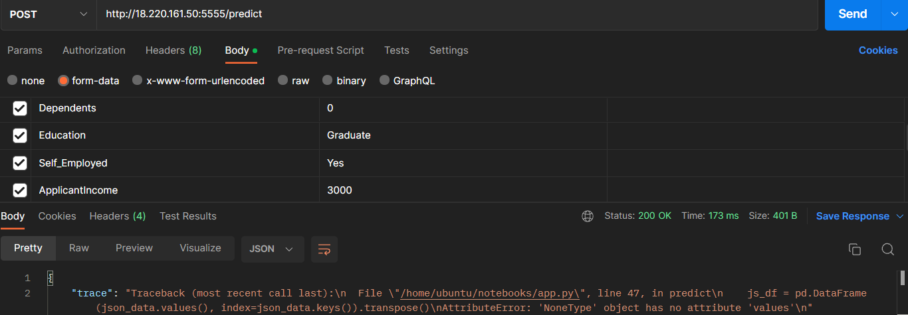

# Lighthouse Labs Mini Project IV - Deployment

### [Assignment Outline](assignment.md)
### [Project Notebook](/notebooks/instructions.ipynb)
### [API Python Code](/notebooks/app.py)
### [Best Model Pickle](/notebooks/best_model.pkl)

## Project/Goals
The goal of this project was to build a working model using supervised learning techniques, that could predict the status of a loan application.

## Hypotheses
1. **Men are more likely to get their loans approved**
    - Misogyny and the patriarchal nature of society. Men have historically been seen as providers, and therefore may have an inherent bias in their favour.
2. **Married couples are more likely to get their loans approved**
    - Dual income means a better chance of having a loan paid on time
3. **Applicants with more dependents are less likely to have their loans approved**
    - Children come with many unexpected expenses, and can be quite costly in general. This may lead to worries about parents not being able to pay a loan back in a timely fashion.
4. **Self-employed applicants are less likely to have their loans approved**
    - People without a steady, guaranteed income may come off as a liability
5. **Applicants with lower loan amounts are more likely to be approved**
    - Smaller amounts are easier for applicants to pay off and could be seen as low risk, they are also a lower loss for the bank
6. **Longer loan term amounts are more likely to be approved**
    - The bank will earn more interest off of long-time loans.

To test these hypotheses, I will check the percentage of each subset who have had their loans approved vs those who were denied.

## EDA 
### 1. Are Men More Likely To Get Approved?
#### Does Marital Status Have An Effect?
- 74.19% of married women were approved
- 64.1% of unmarried women were approved
- 66.97% of women overall were approved

- 72.59% of married men were approved
- 63.2% of unmarried men were approved
- 70.09% of men overall were approved

*Men are more likely overall to be approved*

### 2. Are Married Couples More Likely To Be Approved In General?
- 72.4% of married people were approved

- 63.59% of unmarried people were approved

*Married people are more likely to be approved*

### 3. Do More Kids = Less Money?
#### *[if 3k=0, does 0k=3?](https://www.youtube.com/watch?v=HIEWgwRrY9s)*
- 69.76% of people with 0 dependents were approved
- 64.29% of people with 1 dependent were approved

- 76.53% of people with 2 dependents were approved
- 67.35% of people with 3+ dependents were approved

*2 dependents appears to be the magic number for getting a loan approved*

### 4. Does Being Self-Employed Hurt Your Chances?
- 68.35% of self-employed people were approved
- 70.97% of self-employed people with a graduate degree were approved 
- 58.82% without a graduate degree were approved

- 69.29% of employed people were approved
- 71.16% of employed people with a graduate degree were approved
- 62.5% without a graduate degree were approved

*Employment status does not matter as much as education level!*

### 5. Do Lower Loan Amounts Get Approved More?
- Approved loans had a mean of ~$144k, and a median of ~$126k
- Denied loans had a mean of ~$151k and ~$129k

*Approved loans on average were lower amounts. It is worth noting that approved loans made up of 69.4% of the data, with denied loans only making up %30.5%*

### Does Getting A Longer Term Help?
- The majority of loan terms were 360 months (30 years), so this hypothesis was unable to be properly tested.

## Process

### **EDA**
### 1. Checked % of applicants with a credit history
- 77.36% of applicants had a credit history
### 2. Checked distribution & skew of Applicant & Co-Applicant Income
- The data was heavily skewed right for both the applicant, and the co-applicant. However, this was about in line with what I expected. Although there were some people with higher incomes that applied for loans, the majority appeared to be low-income. Assuming most of these were mortages (property location, term lengths, loan amounts), and the co-applicants were the person with the lower income.

- The high-income outliers are increasing the value of the mean and are not indicative of the actual data.

### 3. Checked frequency of unique categorical variables
- Majority of applicants
    - Were men
    - Were married
    - Did not have kids
    - Had a graduate degree
    - Were not self-employed
    - Lived in the suburbs
    - Had their loan approved

*There were several possible biases that effected the data, mainly gender & loan approval. Due to the fast turnover time of this project, I was unable to spend time on researching how to balance the data, and had to move forward with the understanding that my results may not be accurate. Due to the fact that this is a learning exercise focused on understanding the practical uses of machine learning, and deployment, I felt this was an acceptable sacrifice to make. [fig1](./images/time_cost_quality_student.png)*

### **Data Cleaning**
### 4. Imputed null values and zeros
- Replaced categorical data with mode, and numerical data with mean
- Please refer back to [fig1](./images/time_cost_quality_student.png). This felt like a simpler method to put into a pipeline later, after experimenting with data cleaning pipelines.

### 5. Transformed extreme values
- Performed a log transformation on Loan Amount

### **Feature Engineering**

### 6. Created a total income column
- Summed the applicant & coapplicant incomes to create a column containing the total applicant income
- Performed a log transformation on this new column

### **Modeling**

### 7. Split & trained data
- Split the data 70/30, which resulted in 429 training samples and 185 test samples.
- Used logistic regression (this is a binary classification problem; applicants either are approved or denied)
- First test with no tuning had an accuracy of 73.51%

### 8. Created Pipelines
- Created simple functions to create the total income column, and to do the appropriate log transformations
- Created a pipeline that:
    - created total_income column
    - did appropriate log transformations on data
    - imputed & encoded categorical data
    - imputed & scaled numerical data
    - performed pca
    - selected k-best
    - performed logistic regression
- 

### 9. Ran A Parameter Grid Search
- Attempted to add XGBoost and received errors, replaced with RidgeClassifier at suggestion of a peer
- Received optimal parameters 

## Results/Demo
- Achieved an 84.86% accuracy after tuning parameters
- Created a simple API that would greet the user and direct them to the correct endpoint for POSTing parameters to get a prediction
- Deployment was successful, but there were issues somewhere in the code which lead to errors
- Cried
- Re-write project code as well as API code, taking guidelines & suggestions from peers who had experienced success
- Received a different error
- Cried some more
- 
- Will take some time in the future to investigate further

## Challenges 
- Less experience with supervised learning
    - My midterm was on unsupervised learning, so despite having practice within compass, I'm still gaining familiarity with supervised learning
- Incredibly short turnover time
    - Balancing quality with time was difficult
- Deployment & AWS
    - Steep learning curve

## Future Goals
- Biases & issues with the data were outlined above
    - Would like to revisit this and take the time to learn more about different methods to balance data
    - Would like to take the time to use better methods for cleaning the data (setting an 'Other' status for Genders that were not filled out, imputing other missing data based on multiple factors (i.e. setting NaN Loan Amounts based on loan status & gender, etc))
